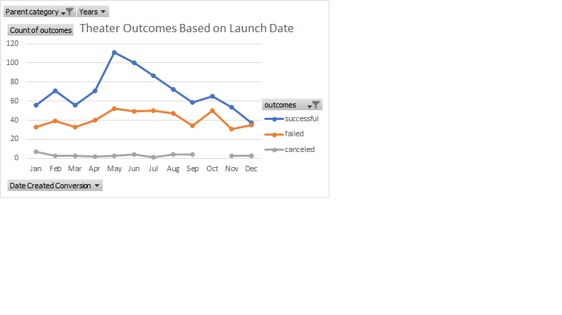
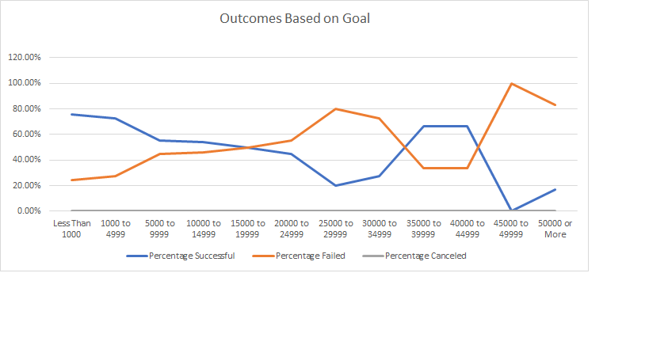

# Kickstarting with Excel

## Overview of Project
In this project we used pivot tables and line graphs to show Louise the different outcomes of theater plays.
### Purpose
 Louise was curious after her play to see how the other plays did. The purpose of this analysis was to show Louise how the different campaigns did in relation to their launch dates and funding goals.

## Analysis and Challenges
 In order to show Louise the outcomes of the plays launch dates and funding goals we had to put the data into pivot tables or figure our the percentage of the plays outcomes. This then led to us creating line graphs to help show Louise the outcome from the data we collected. 

### Analysis of Outcomes Based on Launch Date
 For the first chart shown on Outcomes Based on Launch Date we saw how other theater project outcimes were based on their launch date (month). They were grouped under either "successful", "failed" or "canceled" based on their play outcome numbers by month.
 
### Analysis of Outcomes Based on Goals
#For second chart shown on Outcomes Based on Goals of these theater projects, it groups them by the number of "successful", "failed" and "canceled" projects and put them into ranges from "less than 1000" to "50000 or More". Then grouped them into the percentage of "successful", "failed", and "canceled" projects to go more in-depth. This shows us the final result which is the outcomes these projects had based on how they met their goals

### Challenges and Difficulties Encountered
The few difficulties that came up for the first chart shown was making sure you group the right titles into the pivot table. It is common to put one wrong thing in the wrong place and mess up all the datam it helped that there was a screenshot that showed how the pivot table was supposed to look when ti was finalized. For chart two the only difficulty I had was making sure to select the right columns and rows to create the line chart. If you do not select the right one then you won't get the right data you want shown in the line chart for Louise 
## Results
two conclusions that can be drawn up about the Outcomes based on Launch date is that, there were more successful theater outcomes during May then any other month. Secondly that the failed theater outcomes remained relatively stabilized around the 30-50 count, not varying as much as the successful category
 From the Outcomes Based on Goals we can conclude that the higher the goal was to raise money the more the percentage failed increased and vice a versa for percentage successful.
 Some limitations of this data set are that the plays outcomes could vary by the country the plays are in, therefore taking data on plays from individual countries could give us a more specific detailed outcomes vs taking data from all of the countries. Another limitation is bringing into consideration what caused these plays to be "successful", "failed", and "canceled".
 Some other tables/graphs we could create would be doing a table and graph for the individual countries and narrowing our data down to provide more detail. We could also do a table and graph to show the "successful", "failed", and "canceled" plays for a certain year to provide more detail about what years had the most "successful", "failed", and "canceled" outcomes.

